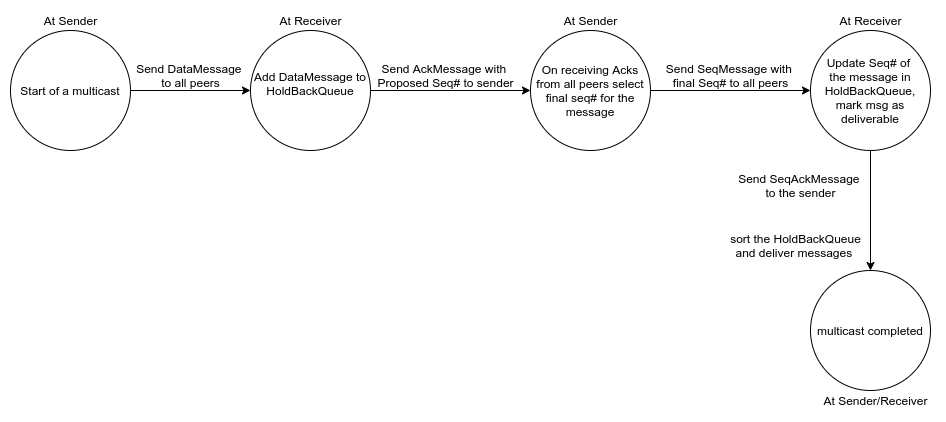

# Total Order Mutlicast using ISIS Algorithm

In order to send a multicast message, `MulticastService::multicast(uint32_t data)` is invoked. This call is
non-blocking, `MulticastService` takes the `data` and returns the control to the sender. The task of sending out various
messages is carried out in different threads.

While constructing `MulticastService`, a `MsgDeliveryCb` callback is passed as argument. This callback is invoked when
a multicast message needs to be delivered to the process.

### Implementing Reliable Delivery of Messages using UDP

##### ContinuousMsgSender

Mutlicast service uses UDP to send and receive various types of messages.
UDP inherently does not guaranty delivery messages, a message sent can be lost in transit and never be delivered.
The reliable delivery of messages is implemented an abstraction inside `ContinuousMsgSender`.
`ContinuousMsgSender` is a C++ templated class. It internally maintains a list of messages of type `T` and for each
message `M` it maintains a set of recipients `R`. At a interval `t`, it sends out message `M` to all its
recipients in set `R`. It exposes a method `removeRecipient(uint32_t messageId, const std::string &recipient)`
to remove a recipient from the recipients set `R`. A message `M` is a part of the internal list until the recipients set `R`
becomes empty.

The initial interval is 200ms and then it increases exponentially upto a `maxSendingInterval=4000ms` (400ms, 800ms, 1600ms, 3200ms).
Once the `maxSendingInterval` is reached, the interval is reset to 200ms.

Thus a message sent using `ContinuousMsgSender` will be retransmitted at a fixed interval no matter whether
it is received or not at the receiver.

### State Diagram
The state machine of the Multicast Service is as follows:

### Implementing the State Machine

- In order to send a multicast message, a sender `s` creates a `DataMessage` and queues it with an instance of
`ContinuousMsgSender<DataMessage>`. `ContinuousMsgSender<DataMessage>` starts sending the `DataMessage` to all
its recipients.

- On receiving a `DataMessage` at a recipient `r`, `r` add the `DataMessage` to the `HoldBackQueue` along with a
`proposedSeq` and `r` sends `AckMessage` to `s` once.
    The `AckMessage` serves two purposes:
    - It contains the `proposed_seq` for a `DataMessage`
    - It acks as acknowledgement for `s` that `r` received the `DataMessage`

- On receiving the all `AckMessage` at `s`, `s` stores the `proposedSeqId` and removes `r` from the recipients set `R`
inside `ContinuousMsgSender<DataMessage>`, `ContinuousMsgSender<DataMessage>` stops sending `DataMessage` to `r`.
Once `AckMessage` from all recipients is received, `s` creates a `SeqMessage` and queues it with an instance of
`ContinuousMsgSender<SeqMessage>`. `ContinuousMsgSender<SeqMessage>` starts sending the `SeqMessage` to all
its recipients.
    The `SeqMessage` serves two purposes:
    - It contains the `final_seq` for a `DataMessage`
    - It acks as acknowledgement for `r` that `s` received the `DataMessage`

- On receiving a `SeqMessage` at a recipient `r`, `r` marks the `DataMessage` in `HoldBackQueue` as deliverable and
sorts the `HoldBackQueue` and sends `SeqAckMessage` to `s` once. If a `DataMessage` at front of the queue is deliverable,
it delivers it.
    The `SeqAckMessage` serves the following purposes:
    - It acks as acknowledgement for `s` that `r` received the `SeqMessage`

- On receiving a `SeqAckMessage` at `s`, `s` removes `r` from the recipients set `R` inside
`ContinuousMsgSender<SeqMessage>`, `ContinuousMsgSender<SeqMessage>` stops sending `SeqMessage` to `r`.

##### HoldBackQueue
- It internally uses a `deque` to store `PendingMsg`. A pending message consists of the `DataMessage` to be delivered,
the `final_seq`, the `final_seq_proposer` and whether the message is `deliverable` or not.

- No two messages in the `HoldBackQueue` can have same `sender` and same `msg_id`. This invariant helps discard the
duplicate `DataMessage` which are received due to retransmission.

- As soon as a `PendingMsg` is marked deliverable, the `deque` is sorted according to the `final_seq`. If two messages
have same `final_seq`, then the one which is undeliverable is placed ahead of deliverable. If two messages have same
`final_seq` and are undeliverable, then the message with smaller `final_seq_proposer` is placed ahead.

##### How a process delivers its own message?
- The process also sends the multicast `DataMessage` to itself and follows the state machine to deliver its own message.

- This approach helps to keep the design generic and implementation simple. This simplified design helps the
implementation to avoid using unnecessary `if-else`.

##### How a message is delivered?
- Once a message is popped out of the `HoldBackQueue`, the `MsgDeliveryCb` is invoked on the popped `dataMsg`.
- Before invoking the callback, a log line is printed to indicate delivery.  
E.g. `I1013 05:04:15.607774    11 multicast.cpp:460] delivering dataMsg: type: 1, sender: 2, msg_id: 4, data: 14, finalSeqId: 9, finalSeqProposer: 1`

##### How message loss in transit is simulated?
- All messages are received inside `MulticastService::startListeningForMessages()`. On arrival of any time of a message,
`MulticastService::dropMessage` is invoked. If `--dropRate` is set, then it generates a `0 < random_number < 1`, if the
`random_number < dropRate`, the message is dropped.
- Before dropping the message, a log line is printed to indicate message drop.  
E.g. `W1013 04:49:14.118077     8 multicast.cpp:349] dropping SeqAckMsg from: sumeet-g-beta.cs7610-bridge`
*Note:* grepping for the dropped messages will show a lot of `DataMessage` and `SeqMessage` relative to `AckMessage` and
`SeqAckMessage`, since `ContinuousMsgSender<DataMessage>` and `ContinuousMsgSender<SeqMessage>` are sending them
at regular intervals.

##### How message delay in transit is simulated?
- Before sending a `AckMessage` or `SeqAckMessage`, `MulticastService::delayMessage` is invoked. If `--delay` is set, then
50% of the message are delayed by the given `delay`.
- Before delaying the message, a log line is printed to indicate message delay.  
E.g. `W1013 04:40:28.443655     8 multicast.cpp:356] delaying messageType: SeqAckMsg by 2000ms`
*Note:* `DataMessage` and `SeqMessage` are sent continuously over a regular interval, this induces an inherent delay.
Hence grepping for delayed messages will only show `AckMessage` and `SeqAckMessage`.

##### What happens if a message is dropped or delayed?

*Note:* A `MsgIdentifier` which consists of `sender` and `msg_id` is used to identify duplicate messages.

- `DataMessage`
    - If dropped or delayed, it will be retransmitted by `ContinuousMsgSender<DataMessage>` at `s` until a `AckMessage` is
    received from `r`.
    - Duplicate `DataMessage` received at `r` will be dropped.

- `AckMessage`
    - If dropped or delayed, `s` will retransmit `DataMessage` which will force `r` to send `AckMessage` to `s`. This cycle will
    continue until a `AckMessage` is received at `s`.
    - Duplicate `AckMessage` received at `s` will be dropped.

- `SeqMessage`
    - If dropped or delayed, it will be retransmitted by `ContinuousMsgSender<SeqMessage>` at `s` until a `SeqAckMessage` is
    received from `r`.
    - Duplicate `SeqMessage` will be dropped at `r`

- `SeqAckMessage`
    - If dropped or delayed, `s` will retransmit `SeqMessage` which will force `r` to send `SeqAckMessage` to `s`. This cycle will
    continue until a `SeqAckMessage` is received at `s`.
    - Duplicate `SeqAckMessage` received at `s` will be dropped.

### Testing the MulticastService

During the development phase, it was important to check whether all processes agree on the delivery order of all messages.
Manual verification helps, if there is just one multicast sender. On increasing the number of senders and the number of
messages each sender sends, manual verification becomes tedious and can lead to false positives or true negatives.

To solve this problem, the `MulticastSuite` test suite was developed and can found in `test_multicast.py` file. The test
suite contains various test cases to simulate multiple senders, dropping and delaying of messages. All the case are listed
under [Test Cases](README.md#Test-Cases) section in README.md.

Each test case invokes a `MulticastSuite.__test_wrapper` method, and simulates various cases by passing the corresponding
argument. E.g. `drop_rate` is passed to simulate dropping messages, `delay` is passed to simulate message delays, so on
and so forth. The `MulticastSuite.__test_wrapper` method starts docker containers for each host mentioned in the `hostfile`.
After starting all the docker containers, it tails the container logs until the expected number of messages are delivered.
Once all the messages are delivered to all processes, the delivery order of messages across all processes is asserted
with each other. If delivery order of any message is different for any process, then the test case fails.

# Chandy Lamport Snapshot Algorithm

##### Recording Local State

##### Recording Incoming Channels

##### On algorithm termination

- Snapshot
    - what all is printed, when is printed

- the containers do not exit on their own, but are stopped in the tearDown phase of the test

- the local state of the sender will only contain data for continuous sender